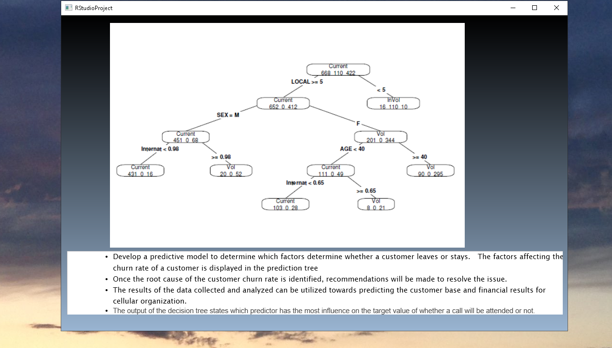

# Databases and Data Mining

The project provides an example of data mining projects. Confidential information is not displayed. 
Please download the executable in https://github.com/alpaddesai/DatabasesandDataMining/releases  for details.
All images are either custom by Alpa D Desai or a reference name is included.Most of the images are custom. 
Copyright protection is in process.

## Data Mining

## Linear Regression

## Decision Tree

## Transforming Data

## RStudio Project

## Predictors for Gold

## Regression S&P Index

